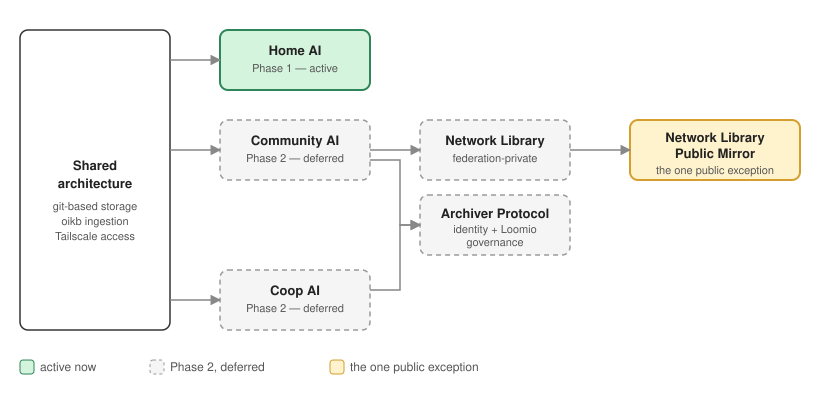

# private-ai

**A household that owns its own AI, instead of renting one.**

Five people, one shared brain, zero cloud dependency. 

private-ai is a self-hosted AI platform built around a simple premise: the same conversational AI experience people already pay $20/month per person for, running instead on hardware the household owns outright — with a knowledge base built from what the household deliberately chooses to teach it, not from silently ingesting everyone's private notes.

The same underlying architecture — **a private per-person layer, a deliberately-curated shared knowledge base, one local AI brain serving everyone** — extends beyond the household to two further use cases: a community association archive, and a cooperative's formal governance record. 

One design, three contexts.

## Why this, not a subscription

- **No recurring cost.** One hardware purchase, not $100+/month indefinitely for five separate subscriptions.
- **Privacy by construction, not by policy.** Personal notes are never ingested by the AI — only what's deliberately pushed to a shared library ever becomes part of what the AI knows. No provider terms of service to trust, because there's no provider.
- **Immune to the failure mode that ruined shared broadband.** A fixed, ACL-enforced account count means there's no path for the customer count to quietly grow past the hardware — because there's no one selling seats.
- **Backup as a side effect of daily use, not a chore.** The same git-sync habit that keeps a vault current across a phone and a tablet produces a tested backup for free — no separate discipline required, and for the shared library, AI access itself is the incentive: no push, no backup, no AI.
- **No open ports, ever** — remote access is a private Tailscale network throughout. The one deliberate, separately-scoped exception is a public mirror of already-decided-to-be-public archive content, with no AI assistant on the public side.

## Open Source

**private-ai itself is licensed AGPL-3.0** — see [`LICENSE.md`](LICENSE.md). Chosen deliberately over a more permissive license: AGPL specifically closes the loophole that lets someone take open code, run it as a closed SaaS, and never give anything back — the same failure mode this whole project exists to opt out of.

That's private-ai's own license. It's worth being equally clear about the software it's actually *built from*, rather than letting "open source" cover the whole stack by implication — that would be exactly the marketing-speak this project doesn't do:

| Component | License | Status |
|---|---|---|
| Ollama | MIT | Open source |
| Open-WebUI | BSD-3-Clause | Open source (a separate trademark-style clause requires permission to use their name/branding — doesn't affect source freedom) |
| Forgejo | GPL-3.0 | Open source — community-governed (Codeberg e.V., non-profit), not a for-profit entity; chosen over Gitea for this reason specifically, see `DECISIONS.md` |
| Loomio | AGPL-3.0 | Open source |
| Radicle | MIT/Apache-2.0 | Open source |
| GitJournal | AGPL-3.0/Apache-2.0 mix | Open source |
| Redis (v8+) | AGPLv3 (one of three license options) | Open source — returned to an OSI-approved license in 2025 after a period on a non-free source-available license; worth knowing if pinning an older version |
| Tailscale | BSD-3-Clause (client) | The client app is open source; the coordination server it talks to is Tailscale's own proprietary SaaS. [Headscale](https://github.com/juanfont/headscale) is a genuine open-source alternative control server, not currently adopted here |

Every piece of software this project actually runs on is open source — no exceptions, now that the Personal Layer editor moved from Obsidian (closed source) to GitJournal.

## Project structure — two phases

**Phase 1 — Home AI (active).** A private AI platform for a 5-person household. This is where real hardware decisions, real suppliers, and real setup work are happening right now — see Status below.

**Phase 2 — Community AI & Coop AI (deferred).** The same architecture applied to a community association's shared archive, and to a cooperative's formal governance record. Deliberately not started yet — Phase 2 waits until Phase 1's real-world trial has actually validated the core design.

## Documents

`DECISIONS.md` — a scannable log of every major decision made on this project, one line each, linked to the source doc. Start here if you want the *what* and *why* without reading every file's version history.

`Comparison.md` — the core privacy claim explained properly: why private-ai's data/model separation is structural, not a policy setting, contrasted against how SaaS AI actually handles training on conversations.

**Root — Phase 1 (Home AI, active):**

| File | What it is |
|---|---|
| `spec-home-ai.md` | **Home AI** — private, 5-person household platform. Android-first Personal Layer + shared Ollama/Open-WebUI "Brain." Currently Draft v20. |
| `implementation-checklist.md` | Companion to the Home AI spec — 17 open build/decision items, execution detail kept separate from the pitch. |
| `hardware-brain-pc.md` | Live decision record for the shared Brain AI PC — supplier (Radiance Systems), model, Turnkey Pack, cost tally, setup sequence. |
| `hardware-tablet.md` | Live decision record for the five Personal Layer devices — requirements, selection criteria, per-device setup sequence. |
| `hardware-power.md` | Live decision record for backup power — Phase 1 UPS (decided) and Phase 2 off-grid solar + battery (deferred, sized for a 24-hour outage). |

**`/phase2` — Phase 2 (Community AI, Coop AI, and anything sequenced with them — deferred):**

| File | What it is |
|---|---|
| `phase2/spec-community-ai.md` | **Community AI** — 6-person "Archiver" board building a collaboratively-curated digital archive. Introduces the Node Library (private to one node) and Network Library (shared across federated nodes via Radicle). |
| `phase2/spec-coop-ai.md` | **Coop AI** — same architecture, aimed at formal cooperative governance: board resolutions and records via Loomio, made AI-queryable. |
| `phase2/archiver-protocol.md` | **Governance mechanism** shared by Community AI and Coop AI — hardware-token identity, Loomio as the vote/decision layer, git-level enforcement simplified to identity verification. |
| `phase2/hardware-relaybox.md` | Placeholder for the relay box hardware decision — not started, deferred until Phase 1 validates. |
| `phase2/data-template.md` | Reusable template for adding passive sensor/monitoring data (solar, weather, etc.) to a node's knowledge base — deterministic poll, never live AI tool-access. Sequenced with Phase 2: Phase 1 is core AI + human-scale data only. |
| `phase2/notes.md` | Running holding-pen for Phase 2 decisions/clarifications surfaced early — not yet applied to the actual specs. |
| `phase2/network-library-public-mirror-overview.md` | The one deliberate exception to "no open ports" — a public, browsable/searchable mirror of the Network Library. No AI assistant on the public side; visitors bring their own. |

## How they relate

Green = active now. Dashed = Phase 2, deferred. Yellow = the one deliberate public-facing exception. Worth noticing the Archiver Protocol only feeds Community AI and Coop AI — Home AI has no governance layer, it doesn't need one.

## Status

**Phase 1 — Home AI:** spec at Draft v20. Hardware finalized with Radiance Systems — CoreAI 16 (RTX 5060 Ti 16GB) with their Turnkey AI Pack, full custom configuration confirmed at no extra cost, quoted at €2,362.31 (VAT included, Italy delivery). Order confirmation sent; awaiting deposit details. Personal Layer trial will run on five existing/random Android devices (not new purchases), a deliberate stress test of the spec's device-compatibility claim. Next concrete action, independent of the order: run the checklist's backup restore test (item 1).

**Phase 2 — Community AI, Coop AI:** not started. Deferred by design until Phase 1's real-world trial validates the core approach.

Version numbers in each spec's own header/footer reflect that document's individual draft history — not all documents are at the same maturity; Coop AI is v1, Home AI is v20.

## Governing principle throughout

No open ports, nothing exposed to the public internet, private Tailscale network only — held everywhere except the Network Library Public Mirror, which is the one deliberate, separately-scoped exception.
